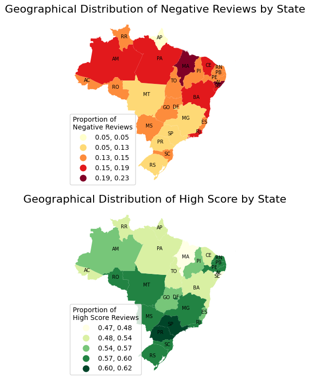
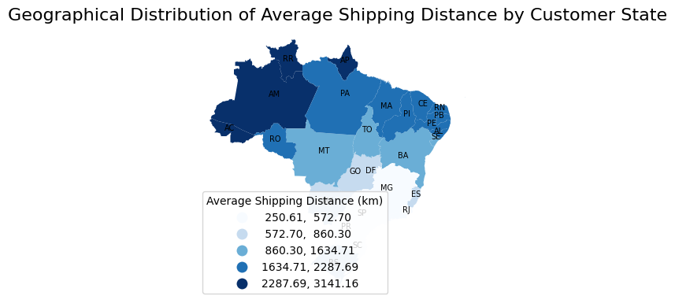
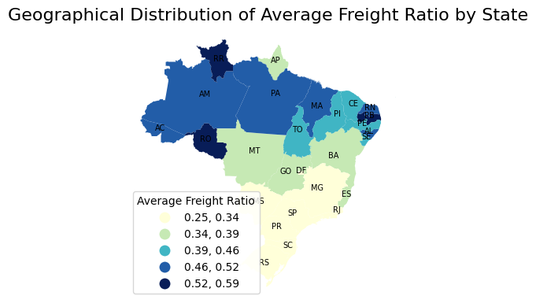

# Geospatial Machine Learning for Predicting Customer Dissatisfaction in Brazilian E-commerce
## 1. Business Context
Olist is a large e-commerce platform operating across Brazil, connecting sellers and customers nationwide. As the platform continues to expand into new markets and scale its operations, maintaining a consistent and satisfactory customer experience becomes increasingly critical.

Customer reviews provide direct signals of user dissatisfaction and potential friction points in the order fulfillment process. However, it is currently unclear that what factors influencing negative customer experiences most, and whether negative reviews are evenly distributed across regions or concentrated in specific areas, which may pose a risk to sustainable growth if left unaddressed.

This leads to the project's core question:
```code
Which orders are most likely to result in negative customer reviews, and what operational factors drive these outcomes?
```

## 2. Dataset
Data sources: Brazilian E-Commerce Public Dataset by Olist (from [Kaggle](https://www.kaggle.com/datasets/olistbr/brazilian-ecommerce))

The following datasets are included:
| Dataset | # of Features | Features | Size |
|---------|---------------|----------|------|
| orders | 8 | `order_id`, `customer_id`, `order_status`, `order_purchase_timestamp`, `order_approved_at`, `order_delivered_carrier_date`, `order_delivered_customer_date`, `order_estimated_delivery_date` | (99441, 8) |
| order_items | 7 | `order_id`, `order_item_id`, `product_id`, `seller_id`, `shipping_limit_date`, `price`, `freight_value` | (112650, 7) |
| customers | 5 | `customer_id`, `customer_unique_id`, `customer_zip_code_prefix`, `customer_city`, `customer_state` | (99441, 5) |
| sellers | 4 | `seller_id`, `seller_zip_code_prefix`, `seller_city`, `seller_state` | (3095, 4) |
| geolocation | 5 | `geolocation_zip_code_prefix`, `geolocation_lat`, `geolocation_lng`, `geolocation_city`, `geolocation_state` | (1000163, 5) |
| product_category_name_translation | 2 | `product_category_name`, `product_category_name_english` | (71, 2) |
| order_reviews | 7 | `review_id`, `order_id`, `review_score`, `review_comment_title`, `review_comment_message`, `review_creation_date`, `review_answer_timestamp` | (99224, 7) |
| products | 9 | `product_id`, `product_category_name`, `product_name_lenght`, `product_description_lenght`, `product_photos_qty`, `product_weight_g`, `product_length_cm`, `product_height_cm`, `product_width_cm` | (32951, 9) |
| order_payments | 5 | `order_id`, `payment_sequential`, `payment_type`, `payment_installments`, `payment_value` | (103886, 5) |

These datasets are merged to construct an order-level analytical dataset.

## 3. Feature Engineering
Features are divided into three categories.

(1) **Delivery performance (derived from timestamps)**
```code
delivery_days # delievered_time - ordered_time
late_delievery # wether an order is late delievered
delay_days # how long an order is delayed
```

(2) **Spatial features**
```code
customer_location
seller_location
shipping_distance # |cutomer_location - seller_location|
seller_density # this is important because higher seller density might cause more logistic burden.
_*engineered from geolocation data*_
```

(3) **Order & product features**
```code
price
freight_ratio # freigh_value / price. Note that freight value is shipping cost.
num_items
```

## 4. Exploratory Data Analysis
Conduct data overview and visualization of:

(1) Reviews

(2) Delivery performance

(3) Shipping distance

(4) Seller & Customer

### Modeling

**Baseline** models include **Logistic Regression and Random Forest**, while **XGBoost** is used as the primary predictive model.

The modeling task is framed as a binary classification problem to predict the probability of negative reviews.

Given the imbalanced nature of the dataset, model performance is evaluated using **ROC-AUC and recall**, with particular emphasis on the model’s ability to detect negative cases.

## 6.Model Interpretation
Model interpretation is conducted using feature importance analysis from XGBoost to identify the key drivers of customer dissatisfaction.

## 7. Spatial Analysis
### Integrated Spatial & Modeling Insights

Combining spatial exploration with modeling results reveals a consistent and interpretable pattern of customer dissatisfaction across regions.

<p align="center">
  
</p>

From a spatial perspective, low-density regions in the northwest—particularly within the Amazon rainforest—are characterized by sparse seller networks, long shipping distances, and higher freight ratios. These structural constraints are associated with weaker logistics performance, including longer and less reliable delivery times.

<table>
  <tr>
    <td></td>
    <td></td>
  </tr>
</table>

However, modeling results show that **delivery performance (e.g., delay_days)**, rather than geographic distance itself, is the dominant driver of negative reviews. While shipping distance varies significantly across regions, it does not emerge as a strong predictor in the model.

This suggests that geography influences customer experience **indirectly**, through its impact on logistics infrastructure and operational efficiency, rather than as a direct factor.

In contrast, densely populated southeastern regions benefit from concentrated seller networks and shorter delivery times, leading to better customer outcomes. These regional advantages are captured in the model through variables such as delivery delay and freight-related features.

Overall, the findings highlight that **logistics performance acts as the key transmission channel between geographic structure and customer satisfaction**, bridging spatial disparities and business outcomes.


## 8. Key Findings

- Delivery delay is the dominant driver of negative reviews, indicating that logistics performance is the primary source of customer dissatisfaction.
- Freight-related factors also contribute to negative experiences, suggesting that cost perception plays an important role.
- Advanced models such as XGBoost improve the detection of negative reviews, increasing recall significantly compared to baseline models.
- However, overall predictive performance remains moderate (ROC-AUC ~0.71), indicating that logistics features alone are insufficient to fully explain customer dissatisfaction.

## 9. Business Implications

The findings of this project provide several actionable insights for improving customer experience on the Olist platform.

First, logistics performance should be prioritized as the primary lever for improving customer satisfaction. Since delivery delay is identified as the strongest predictor of negative reviews, operational efforts should focus on reducing late deliveries through better routing, inventory placement, and last-mile coordination.

Second, a region-specific strategy is necessary. Low-density regions in the northwest face structural disadvantages such as long shipping distances and sparse seller networks. Rather than applying uniform standards, Olist should consider targeted interventions in these regions, such as expanding local seller networks or partnering with regional logistics providers.

Third, cost perception plays an important role in customer dissatisfaction. The significance of freight-related features suggests that customers are sensitive not only to delivery speed but also to shipping costs. Improving price transparency or offering shipping subsidies in high-cost regions may help mitigate negative experiences.

Overall, these findings suggest that improving logistics efficiency—rather than addressing geographic distance directly—is the most effective way to enhance customer experience.

## 10. Limitations

Several limitations should be considered when interpreting the results of this analysis.

First, the model does not include comprehensive delivery performance features. While variables such as delay_days are incorporated, more detailed logistics data (e.g., real-time tracking or fulfillment operations) are not available, which limits the model’s explanatory power.

Second, the predictive performance of the model remains moderate (ROC-AUC ≈ 0.71), indicating that customer dissatisfaction is influenced by additional factors beyond those captured in the dataset, such as product quality or customer expectations.

Third, the spatial analysis is conducted at a relatively coarse geographic level. State-level aggregation may obscure important variations at the city or zipcode level, limiting the precision of spatial insights.

Finally, this study is based on observational data, and the results should be interpreted as correlations rather than causal relationships.

## 11. Future Work

Future work can extend this project in several directions to improve both analytical depth and practical impact.

First, incorporating richer logistics data—such as fulfillment time, warehouse location, and real-time delivery tracking—would provide a more comprehensive understanding of delivery performance and its impact on customer satisfaction.

Second, increasing spatial granularity to the city or zipcode level would enable more precise identification of regional inefficiencies and support more targeted operational strategies.

Third, integrating additional behavioral and product-related features (e.g., product category, seller reputation, and customer history) may improve model performance and provide a more holistic view of the drivers of negative reviews.

Finally, extending the analysis to a temporal or panel data framework would allow for the study of changes in customer experience over time, offering deeper insights into how logistics improvements or market dynamics affect outcomes.

## Project Structure
```code
data/
datasets

notebooks/
01_data_overview.ipynb
02_feature_engineering.ipynb
03_modeling.ipynb

outputs/
visualizations
